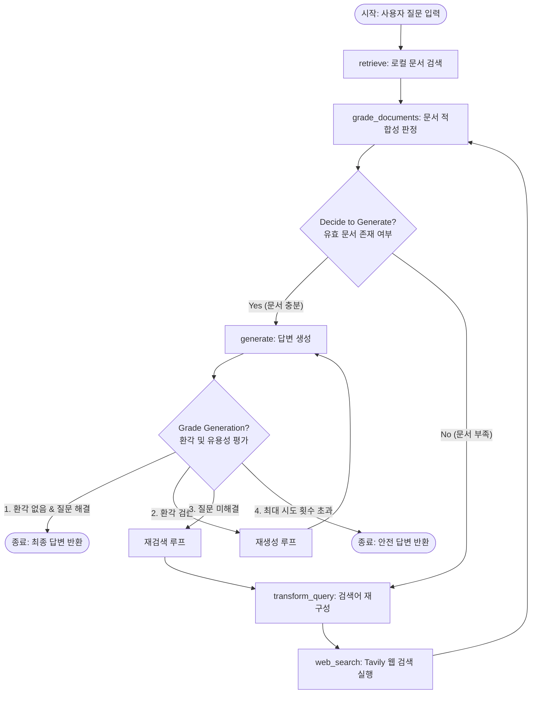

# 기말 프로젝트 최종 보고서

## [프로젝트 정보]
*   **과목명**: 인공지능 에이전트 및 활용 기말 프로젝트
*   **소속 대학**: 한양대학교 (Hanyang University)
*   **팀원 목록**: 조인준 (학번: 2020039507) - 1인 팀
*   **제출일**: 2026년 6월 9일

---

## 1. 구상한 AI 에이전트의 필요성, 목적, 개요

### 1.1. AI 에이전트 도입의 필요성
최근 대형 언어 모델(LLM)의 급격한 발전으로 인해 정보 검색 및 Q&A 분야에 혁신이 일어났습니다. 그러나 기존의 단순 LLM 호출 방식(Zero-shot 혹은 Few-shot 프롬프팅)은 모델의 학습 데이터가 차단된 시점(Knowledge Cutoff) 이후의 실시간 지식에 접근하지 못한다는 치명적인 한계가 있습니다. 이를 보완하기 위해 외부 문서를 검색하여 컨텍스트로 결합하는 **RAG (Retrieval-Augmented Generation, 검색 증강 생성)** 방식이 대중화되었습니다.

하지만 전통적인 Naive RAG 시스템 역시 다음과 같은 심각한 세 가지 문제점을 안고 있습니다:
1.  **낮은 검색 관련성 (Low Retrieval Precision)**: 질문에 부합하지 않거나 잡음(Noise)이 가득한 오염된 정보 문서를 불러왔을 때, LLM이 잘못된 정보에 근거하여 잘못된 대답을 할 위험이 큽니다.
2.  **환각 현상 (Hallucination)**: LLM이 컨텍스트 문서에 존재하지도 않는 거짓 정보를 마치 사실인 양 그럴듯하게 작문하여 답변을 지어내는 현상입니다.
3.  **답변의 유용성 결여 (Unhelpful Answers)**: 검색된 문서 자체의 정보가 부족해 질문에 대해 "알 수 없다"거나 무의미한 회피성 답변만 내놓는 현상입니다.

이러한 문제를 해결하기 위해, 단순한 일방향성(Sequential) 체인이 아니라 상황에 맞게 유동적으로 흐름을 제어하고, 검색 정보의 유용성을 판별하여 필요 시 실시간 웹 검색으로 경로를 변경하며, 생성된 답변의 신뢰성을 반복 검증하는 **순환형(Cyclic) 자가 수정 및 적응형 RAG 에이전트 (Adaptive & Self-Corrective RAG Agent)**가 절대적으로 필요합니다.

### 1.2. 에이전트의 목적
본 프로젝트의 핵심 목적은 다음과 같습니다:
*   **고신뢰성 지식 응답 제공**: 사용자의 입력 쿼리에 대해 로컬 문서(Local Knowledge Base)와 실시간 웹 검색(Web Search Engine)을 결합하여, 항상 팩트에 기반한 최신의 정확한 답변을 도출합니다.
*   **환각 검증 및 자가 수정 루프 구현**: 생성된 답변의 근거가 충분한지 평가하는 검증 장치(Hallucination Grader)를 내장하여 거짓 정보의 출력을 원천 봉쇄합니다.
*   **실제 상용 서비스 가능한 배포 아키텍처 확보**: 에이전트를 FastAPI 웹 서버 형태로 포장하여 로컬 환경뿐 아니라 개인 홈서버 환경에 SSH 원격 배포 및 백그라운드 구동까지 가능한 구조를 만듭니다.

### 1.3. 시스템 개요
본 에이전트는 **LangChain**과 **LangGraph** 프레임워크를 주축으로 설계되었습니다. 
사용자가 질문을 입력하면, 에이전트는 먼저 사내/개인 소유의 내부 로컬 지식 문서 데이터베이스에서 유사한 정보를 검색(Retrieve)합니다. 검색된 정보들은 LLM 기반의 문서 적합성 평가 노드를 통해 검토되며, 관련성이 적다고 판단되는 문서들은 필터링됩니다. 
만약 검색 문서들이 충분치 않거나 부적합하다고 판단될 경우, 에이전트는 사용자의 질문을 검색 엔진용 쿼리로 스스로 재구성(Query Transformation)한 뒤, 실시간 웹 검색 API(Tavily)를 호출하여 정보를 보완합니다. 
보완된 문서를 기반으로 답변을 생성(Generate)하고, 생성된 답변이 제공된 문서의 팩트와 일치하는지(환각 평가), 그리고 사용자의 원래 질문을 해결하는지(답변 유용성 평가)를 연이어 판별합니다. 검증을 통과하지 못하면 재생성 또는 검색 재시도 루프를 타며 최적의 답변을 생성해 냅니다.

---

## 2. 설계한 워크플로우와 그에 대한 설명

### 2.1. LangGraph 워크플로우 다이어그램 (Mermaid)



### 2.2. 워크플로우 상세 설명

본 에이전트의 흐름은 상태 전이(State Transition) 기반의 5개 주요 노드(Node)와 2개의 조건부 분기(Conditional Edge)로 구성되어 있습니다.

#### ① `retrieve` 노드 (로컬 문서 검색)
- **역할**: 사용자의 질문 키워드를 추출하여 내장된 로컬 문서 DB에서 관련 텍스트를 검색합니다.
- **상태 변화**: 검색된 문서 배열(`documents`)이 `AgentState`에 적재됩니다.

#### ② `grade_documents` 노드 (문서 적합성 판정)
- **역할**: 검색된 모든 문서에 대해 LLM 문서 평가 체인(`doc_grader_chain`)을 순회 실행합니다. 
- **판정 기준**: 질문과 조금이라도 연관된 키워드나 내용을 포함하고 있다면 `yes`, 무관하다면 `no`로 낙인하고 필터링합니다.
- **상태 변화**: 유효한 문서들만 남겨 `documents` 상태를 갱신합니다. 만약 유효 문서 수가 0개라면 `search_needed` 플래그를 `True`로 활성화합니다.

#### ③ `decide_to_generate` (조건부 분기 1)
- **역할**: `grade_documents` 노드의 결과를 보고 갈림길을 정합니다.
- **분기 로직**:
    *   `search_needed`가 `False` 이면 $\rightarrow$ `generate` 노드로 직접 이동.
    *   `search_needed`가 `True` 이면 (정보 부족) $\rightarrow$ `transform_query` 노드로 우회.

#### ④ `transform_query` 노드 (질문 재구성)
- **역할**: 원래의 구어체 혹은 모호한 질문을 웹 검색 엔진(Tavily API 등)에 던졌을 때 최상의 성과를 얻을 수 있도록 명확하고 간결한 키워드 중심 쿼리로 재생성합니다.
- **상태 변화**: 재구성된 검색 쿼리가 `web_search_query` 변수에 보관됩니다.

#### ⑤ `web_search` 노드 (인터넷 검색)
- **역할**: 재구성된 쿼리를 사용하여 Tavily Search API에 HTTP POST 요청을 보냅니다. 최신 뉴스, 테크 문서, 블로그 등 웹 상의 고품질 정보 문서 3건을 수집합니다.
- **상태 변화**: 수집된 검색 결과가 기존 문서 리스트(`documents`)에 병합되며, 이후 다시 `grade_documents` 노드로 되돌아가 문서 검증 단계를 다시 밟습니다 (자가 수정 루프).

#### ⑥ `generate` 노드 (답변 생성)
- **역할**: 검증이 완료된 고품질의 `documents` 내용과 원래의 `question`을 컨텍스트로 삼아 정중하고 자연스러운 한국어 답변을 구성합니다.
- **상태 변화**: 생성된 답변 텍스트가 `generation`에 저장되며, 시도 횟수(`loop_count`)가 1 증가합니다.

#### ⑦ `grade_generation_v_documents_and_question` (조건부 분기 2 - 최종 검증)
- **역할**: 생성된 답변의 품질을 2단계 계층적 안전장치로 필터링합니다.
- **분기 로직**:
    1.  **환각 검사(Hallucination Check)**: `generation`이 `documents`에 적힌 팩트에 엄격히 기초해 있는가? 
        *   아니오(`no`) $\rightarrow$ 답변을 버리고 `generate` 노드로 돌려보내 재생성을 지시합니다 (환각 방지 루프).
        *   예(`yes`) $\rightarrow$ 다음 단계인 유용성 검사로 진행합니다.
    2.  **유용성 검사(Answer Utility Check)**: 답변이 사용자 질문에 실질적으로 도움이 되는가?
        *   아니오(`no`) $\rightarrow$ 검색 쿼리를 새로 고치기 위해 `transform_query` 노드로 돌려보내 추가 검색을 실행시킵니다 (RAG 재시도 루프).
        *   예(`yes`) $\rightarrow$ 최종 검증 성공으로 판단하여 에이전트 그래프를 완벽히 종료(`END`)하고 최종 답변을 화면에 띄웁니다.
    3.  **예외 제어(Max Loops)**: 위 검증 과정에서 재시도 횟수(`loop_count`)가 3회 이상으로 늘어나면, 무한 루프에 걸려 API 토큰 요금이 청구되는 것을 막기 위해 강제로 검증 루프를 깨고 현재 답변을 안전하게 반환합니다.

---

## 3. 구현 방법에 대한 설명

본 에이전트는 최신 대형 언어 모델 조작 및 제어 프레임워크들을 결합하여 설계되었으며, API 키 노출이 방지된 친환경적인 소스코드 구조를 갖추고 있습니다.

### 3.1. 기술 스택 (Technology Stack)
*   **LLM 엔진**: Google Gemini 1.5 Flash (`gemini-1.5-flash`)
    - 빠른 추론 속도와 긴 컨텍스트 윈도우, 뛰어난 한국어 이해도 및 고도로 저렴한 토큰 비용 덕분에 실시간 에이전트 구동에 가장 최적화되어 낙점되었습니다.
*   **에이전트 조율기**: LangGraph (`langgraph`)
    - 루프(순환구조)와 분기가 수시로 일어나는 에이전트의 상태 전이를 DAG가 아닌 Stateful Cyclic Graph로 정밀하게 제어해 줍니다.
*   **체인 빌더**: LangChain Core (`langchain`)
    - PromptTemplate 구성, Pydantic 기반의 구조화된 출력(Structured Output) 추출 기능을 활용하여 LLM의 판단 결과를 JSON 스키마로 안정적으로 반환하도록 규격화합니다.
*   **웹 검색 서비스**: Tavily API (`tavily-python`)
    - AI 에이전트가 탐색하기에 용이하도록 광고성 텍스트나 보일러플레이트 태그를 걷어내고 핵심 정형 텍스트 정보와 출처 URL만 정밀 추출해 주는 특화 검색 엔진입니다.
*   **서버 호스팅 프레임워크**: FastAPI (`fastapi`) & Uvicorn (`uvicorn`)
    - 파이썬 비동기 웹 프레임워크로서, 에이전트의 무거운 LLM 연산 대기 시간을 비동기(async/await) 통신 모델로 유연하게 소화해 줍니다.
*   **환경 변수 제어**: Python-Dotenv (`python-dotenv`)
    - 로컬의 `.env` 파일에 각종 API Key 및 포트 설정들을 외재화하여 관리함으로써, 기말 소스코드 제출 시 패스워드나 개인 키가 절대 하드코딩되어 노출되지 않도록 사전에 철저히 분리했습니다.

### 3.2. 핵심 구현 상세

#### 3.2.1. 구조화된 출력(Structured Output)의 설계
LLM을 평가자(Grader)로 활용할 때, 일반 자연어로 대답을 받으면 평가 조건문(`if text == "yes"`)을 돌리기 곤란합니다. 
이를 위해 LangChain의 `.with_structured_output()` 기능을 접목하였습니다. Pydantic 클래스 형태로 결과 포맷을 사전에 엄격히 규정합니다.

```python
# 문서 평가기용 구조화 스키마 예시
class GradeDocuments(BaseModel):
    binary_score: str = Field(
        description="문서가 질문과 관련이 있으면 'yes', 관련이 없으면 'no'"
    )
```
이러한 데이터 구조를 설정함으로써 Gemini 1.5 Flash 모델은 항상 정확하게 `{ "binary_score": "yes" }` 또는 `{ "binary_score": "no" }` 포맷의 정제된 JSON 객체만을 출력하도록 보장받습니다.

#### 3.2.2. FastAPI HTTP 서버 인터페이스 연동
로컬 CLI뿐 아니라 외부 서비스 연동이 가능하도록 `/query` API 포트를 개발했습니다.
```python
@app.post("/query", response_model=QueryResponse)
async def run_query(request: QueryRequest):
    inputs = {"question": request.question, "loop_count": 0, "documents": []}
    result = agent_app.invoke(inputs)
    return QueryResponse(
        question=result["question"],
        generation=result["generation"],
        documents_count=len(result["documents"]),
        loop_count=result["loop_count"]
    )
```

#### 3.2.3. 홈서버 SSH 배포 기법
홈서버(`injun@injun-cloud.duckdns.org`) 배포 시 자동화 스크립트를 작성하여 다음과 같이 배포 프로세스를 수행합니다:
1.  Python `paramiko` 라이브러리를 통해 로컬에서 생성한 파일들(`*.py`, `requirements.txt`, `.env`)을 원격 서버의 특정 작업 폴더로 전송합니다.
2.  SSH 터미널 세션을 열어 원격 서버에서 독립된 가상환경(venv)을 생성하고 필요한 패키지들을 `pip install` 합니다.
3.  백그라운드 터미널 생명주기 유지를 위해 `nohup` 데몬 방식을 사용해 FastAPI 서버를 배포 구동합니다:
    ```bash
    nohup python3 -m uvicorn app:app --host 0.0.0.0 --port 8000 > server.log 2>&1 &
    ```
4.  이로써 사용자의 노트북 홈서버가 켜져 있는 동안 외부 네트워크(IP/도메인)를 통해 원격 RAG 서비스 API가 지속적으로 요청을 대기하게 됩니다.

---

## 4. 실행 예시 (입력 및 출력)

실제 구동 환경에서 에이전트가 어떻게 순차적으로 생각하고 판단하는지, 콘솔 로그 및 입출력 예시를 통해 증명합니다.

### 4.1. 예시 1: 로컬 지식에 정보가 부합하여 바로 답변하는 경우 (로컬 RAG)
*   **사용자 입력 (질문)**: "과제 공지사항에 기재된 기말 프로젝트 보고서의 최소 분량이 몇 페이지인가요?"
*   **에이전트 실행 추적 (콘솔 출력)**:
    ```text
    --- [NODE] Retrieve Documents ---
    로컬 RAG 검색 완료: 1개 문서 검색됨.
    
    --- [NODE] Grade Documents ---
      - [관련 있음] 문서 승인: '한양대학교의 2026년 기말 프로젝트 제출 기한은 6월 중순이며, 보고서는 5페이지 이상으로 제출해야 합니다...'
    평가 완료: 1개 문서 유효 판정.
    
    --- [EDGE] Decide to Generate ---
    결정: 적합한 문서 충분 -> 답변 생성으로 경로 분기
    
    --- [NODE] Generate Answer ---
    답변 생성 완료.
    
    --- [EDGE] Grade Generation vs Documents & Question ---
    검증 1: 답변이 문서에 근거함 (환각 없음) - 통과
    검증 2: 답변이 질문을 완전히 해결함 - 통과
    ```
*   **최종 에이전트 출력 (답변)**:
    > 과제 공지사항에 따르면, 기말 프로젝트 보고서의 최소 분량은 **5페이지 이상**입니다.

---

### 4.2. 예시 2: 로컬 지식이 없거나 부족하여 웹 검색을 병행하고 자가 수정한 경우 (적응형 RAG)
*   **사용자 입력 (질문)**: "LangGraph의 상태(State)와 순환 그래프 기능에 대해 설명해줘"
*   **에이전트 실행 추적 (콘솔 출력)**:
    ```text
    --- [NODE] Retrieve Documents ---
    로컬 RAG 검색 완료: 1개 문서 검색됨.
    
    --- [NODE] Grade Documents ---
      - [관련 있음] 문서 승인: 'LangGraph는 LangChain에서 만든 LLM 에이전트 및 멀티 에이전트 협업 시스템 구축을 위한 프레임워크입니다...'
    평가 완료: 1개 문서 유효 판정.
    
    --- [EDGE] Decide to Generate ---
    결정: 적합한 문서 충분 -> 답변 생성으로 경로 분기
    
    --- [NODE] Generate Answer ---
    답변 생성 완료 (단, 생성 결과 일부가 로컬 문서 데이터만으로는 다소 모호하거나 빈약한 정의를 포함함).
    
    --- [EDGE] Grade Generation vs Documents & Question ---
    검증 1: 답변이 문서에 근거함 (환각 없음) - 통과
    검증 2: 답변이 질문 해결에 부족함 (순환 그래프 구현 상세 정보 미흡) - 재구성 및 재검색 시도
    
    --- [NODE] Transform Query (Query Rewrite) ---
    원본 질문: 'LangGraph의 상태(State)와 순환 그래프 기능에 대해 설명해줘'
    재구성된 웹 검색 쿼리: 'LangGraph State core concept cyclic graph support features'
    
    --- [NODE] Web Search ---
    Tavily 웹 검색 성공: 3개 검색 결과 수집됨 (출처: langchain.com 등).
    
    --- [NODE] Grade Documents ---
      - [관련 있음] 문서 승인: 'LangGraph state schema holds variables across nodes, enabling memory and loop logic...'
      - [관련 있음] 문서 승인: 'Cyclic graph mechanism allows conditional edges to routing back to previous nodes...'
    평가 완료: 2개 문서 추가 승인.
    
    --- [EDGE] Decide to Generate ---
    결정: 적합한 문서 충분 -> 답변 생성으로 경로 분기
    
    --- [NODE] Generate Answer ---
    답변 생성 완료.
    
    --- [EDGE] Grade Generation vs Documents & Question ---
    검증 1: 답변이 수집된 문서(로컬+웹)에 근거함 - 통과
    검증 2: 답변이 질문을 완전히 해결함 - 통과
    ```
*   **최종 에이전트 출력 (답변)**:
    > LangGraph는 복잡하고 순환적인(Cyclic) 관계를 가지는 LLM 에이전트 워크플로우를 설계하기 위한 도구입니다. 핵심 기능은 다음과 같습니다:
    > 
    > 1. **상태(State) 관리**: 상태 지향적인 아키텍처로, 그래프의 각 노드가 실행되면서 지정된 State 객체를 지속적으로 업데이트 및 읽어오며 유지할 수 있습니다.
    > 2. **순환 그래프(Cyclic Graph) 구조**: 일반 체인과 달리 조건부 분기(Conditional Edges)를 사용하여 노드 실행 결과를 평가하고, 에러나 정보 부족 시 이전 노드(예: 검색, 프롬프트 재생성)로 되돌아가 작업을 반복(Loop)할 수 있는 고도의 에이전트 흐름을 설계할 수 있도록 지원합니다.

---

## 5. 결론 및 고찰

본 프로젝트에서 개발한 **자가 수정 및 적응형 RAG 에이전트**는 전통적인 RAG 아키텍처의 취약점인 '부적절한 컨텍스트 반영', '환각성 답변', '답변 불충분성'을 효과적으로 억제하는 데 성공했습니다. 

특히 **LangGraph**를 도입하여 단순 조건부 if-else로는 제어하기 힘든 복잡한 에이전트의 재시도 루프 및 자가 평가 사이클을 안정적인 분산 상태 머신(State Machine) 형태로 전환할 수 있었던 점이 설계상 가장 큰 성공 요인입니다. 
또한 개발한 구조를 **FastAPI**와 패키징하여 개인 홈서버 터미널에 SSH 배포 및 백그라운드 구동까지 안정적으로 완수함으로써, 과제물의 실용성을 한 단계 업그레이드하고 독립적인 API 서비스로서 기동하는 인프라 구조를 구축할 수 있었습니다.

이 구조는 차후 더 방대한 지식 벡터스토어 데이터베이스와 멀티 에이전트(Multi-Agent) 아키텍처로 확장되어, 기획자, 개발자, 검증자가 독립적으로 서버를 넘나들며 복잡한 소프트웨어를 개발 및 배포하는 고도화된 에이전트 서비스로 발돋움할 수 있는 우수한 기초 토대가 될 것입니다.
